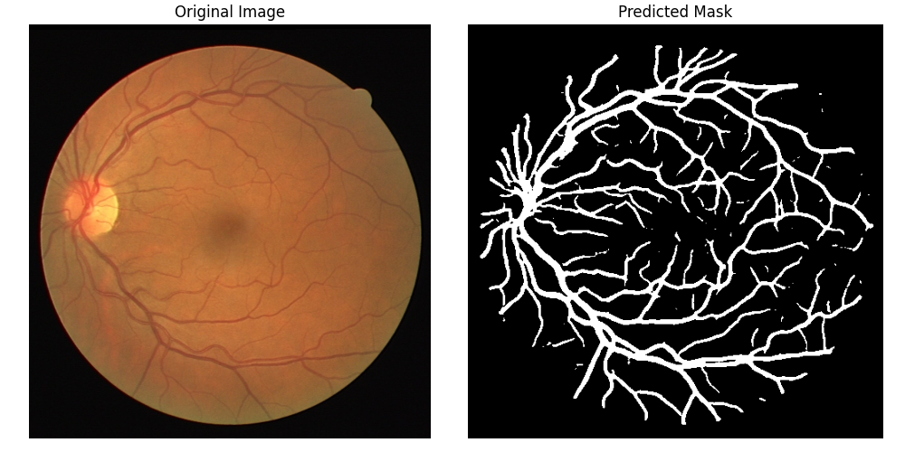
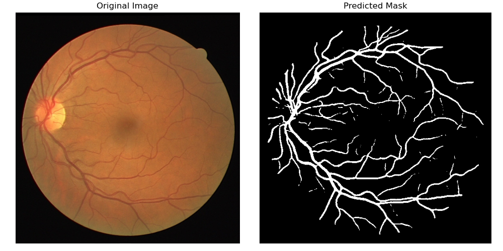

# Retinal Vessel Segmentation using U-Net

This project performs **semantic segmentation** of blood vessels in retinal images using a U-Net architecture, trained on the [DRIVE](https://drive.grand-challenge.org/) dataset. The goal is to assist in diagnosing diabetic retinopathy and related conditions.

---

## Getting Started

### 1. Clone the Repository

```bash
git clone https://github.com/Suyog-16/retinal-vessel-segmentation.git
cd retinal-vessel-segmentation
````

### 2. Install Dependencies

Use a virtual environment:

```bash
conda env create -f environment.yml
```

---

## Training

Place the DRIVE dataset inside the `dataset/` folder in the following format:

```
dataset/
├── training/
│   ├── images/
│   └── masks/
├── test/
│   ├── images/
│   └── masks/
```

Run training with customizable hyperparameters via CLI arguments:

```bash
python src/train.py --batch_size 2 --epochs 50 --lr 0.0001
```

| Argument       | Description                 | Default |
| -------------- | --------------------------- | ------- |
| `--batch_size` | Batch size for training     | 2       |
| `--epochs`     | Number of training epochs   | 50      |
| `--lr`         | Learning rate for optimizer | 0.0001   |

The best model checkpoint will be saved automatically at `models/best_unet.pth`.

---

## 🔍 Inference & Demo with Streamlit

You can run the Streamlit app to demo model inference on retinal images:

1. Run the Streamlit app:

```bash
streamlit run app/app.py
```

2. Use the web interface to upload images and see vessel segmentation results interactively.


---

## 🔍 Inference (CLI)

You can also test your trained model on a new image using the inference script.

### 1. Place test images

Put the image(s) you want to test in a folder, for example:

```
img/
└── example_image.png
```

### 2. Run inference

```bash
python src/inference.py --img_path img/example_image.png --model_path models/unet_weights.pth
```

### 3. Output

* The segmentation result will be displayed using matplotlib.
* You can modify the script to save the output to disk if needed.

---

## ⚙️ Inference Script Arguments

| Argument       | Description                           | Default                   |
| -------------- | ------------------------------------- | ------------------------- |
| `--img_path`   | Path to the input image               | Required                  |
| `--model_path` | Path to the trained model `.pth` file | `models/best_unet.pth` |

---

## Evaluation Metrics

* **Dice Score**: \~0.76 on DRIVE test set
* **IoU Score**: \~0.62 on DRIVE test set

---

## Features

* Custom U-Net architecture in PyTorch
* Combined BCE + Dice Loss for better performance
* Data augmentation with Albumentations
* Easily  accesible by streamlit web demo

---

## Sample Results

 <br>


---

## Acknowledgments

* Dataset: [DRIVE](https://drive.grand-challenge.org/)
* U-Net: Ronneberger et al., 2015
* Augmentations: [Albumentations](https://albumentations.ai)

---

## License

MIT License

