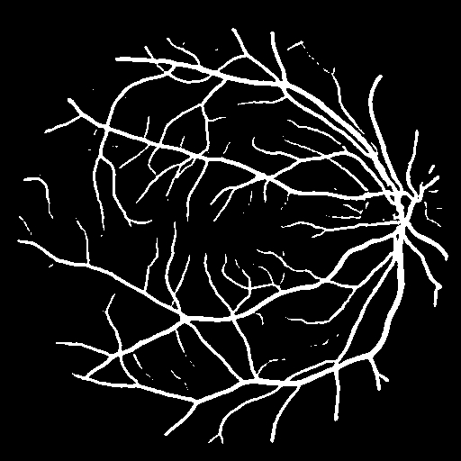

# Retinal Vessel Segmentation using U-Net

This project performs semantic segmentation of blood vessels in retinal fundus images using a custom U-Net architecture. The model is trained on the [DRIVE dataset](https://drive.grand-challenge.org/) to assist in early diagnosis of diabetic retinopathy and other retinal diseases.

##  Features
- Custom U-Net implementation in PyTorch
- Combined BCE + Dice loss for improved performance
- Data augmentation with Albumentations
- Streamlit-powered interactive demo
- Evaluation metrics: Dice Score ~0.76, IoU ~0.62

---

## Dataset Structure

Place the DRIVE dataset inside the `dataset/` directory in the following format:

```

dataset/
├── training/
│   ├── images/
│   └── masks/
├── test/
│   ├── images/
│   └── masks/

````

---

##  Setup Instructions

### 1. Clone the Repository
```bash
git clone https://github.com/Suyog-16/retinal-vessel-segmentation.git
cd retinal-vessel-segmentation
````

### 2. Install Dependencies (Using Conda)

```bash
conda env create -f environment.yml
conda activate retinal-vessel-seg
```

**Requirements:**

* Python 3.10+
* PyTorch >= 1.9
* Albumentations
* Streamlit
* Numpy, matplotlib, etc.

---

##  Training the Model

```bash
python src/train.py --batch_size 2 --epochs 50 --lr 0.0001
```

**CLI Arguments:**

| Argument       | Description                 | Default |
| -------------- | --------------------------- | ------- |
| `--batch_size` | Batch size for training     | 2       |
| `--epochs`     | Number of training epochs   | 50      |
| `--lr`         | Learning rate for optimizer | 0.0001  |

Model checkpoints are saved in `models/`. Best checkpoint: `models/best_unet.pth`.

---

##  Inference

### 1. CLI Inference

```bash
python src/inference.py --img_path img/example.png --model_path models/best_unet.pth
```

This displays the segmentation output using matplotlib. You can also save the output by modifying the script.

### 2. Streamlit Web App

```bash
streamlit run app/app.py
```

Use the web interface to upload images and visualize segmented blood vessels in real time.

---

## 📊 Evaluation Metrics

| Metric     | Score on DRIVE Test Set |
| ---------- | ----------------------- |
| Dice Score | \~0.76                  |
| IoU Score  | \~0.62                  |

---

##  Sample Results

<table>
  <tr>
    <th>Input Image</th>
    <th>Ground Truth</th>
    <th>Model Prediction</th>
  </tr>
  <tr>
    <td></td>
    <td></td>
    <td></td>
  </tr>
  <tr>
    <td></td>
    <td></td>
    <td></td>
  </tr>
</table>

##  Model Architecture

This project uses a custom U-Net variant with the following key improvements over the original architecture:

- Each block is Conv → BatchNorm → ReLU (for better convergence)
- Modular `DoubleConv` blocks used for cleaner design
- Standard encoder–decoder with skip connections
- Output is a binary segmentation map (1-channel)
- Trained with a compound loss: **BCE + Dice Loss**

This setup offers improved training stability and better performance on small datasets like DRIVE.


---

##  References

* [U-Net: Convolutional Networks for Biomedical Image Segmentation](https://arxiv.org/abs/1505.04597)
* [Albumentations: A fast and flexible image augmentation library](https://albumentations.ai/)
* [DRIVE dataset](https://drive.grand-challenge.org/)

---

##  License

This project is licensed under the MIT License.

```

